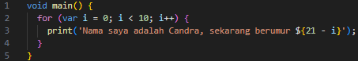
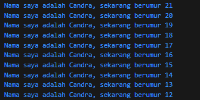
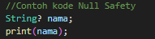
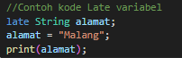

# Tugas Praktikum

## Soal 1  
Modifikasilah kode pada baris 3 di VS Code atau Editor Code favorit Anda berikut ini agar mendapatkan keluaran (output) sesuai yang diminta!  

  

### Output yang diminta  
  

### Jawab 
  

### Output 
  

---

## Soal 2  
**Pertanyaan:**  
Mengapa sangat penting untuk memahami bahasa pemrograman Dart sebelum kita menggunakan framework Flutter?  

**Jawaban:**  
Memahami bahasa pemrograman Dart sangat penting sebelum menggunakan framework Flutter karena Flutter dibangun dengan bahasa Dart. Tanpa memahami dasar Dart, pengembang akan kesulitan menulis kode yang efisien, membaca error, atau mengimplementasikan konsep dasar seperti variabel, fungsi, OOP, null safety, serta asynchronous programming. Pemahaman Dart membantu kita fokus pada pengembangan antarmuka dan logika aplikasi di Flutter tanpa terhambat masalah sintaksis dan dasar bahasa.  

---

## Soal 3  
**Pertanyaan:**  
Rangkumlah materi dari codelab ini menjadi poin-poin penting yang dapat Anda gunakan untuk membantu proses pengembangan aplikasi mobile menggunakan framework Flutter.  

**Jawaban:**  
- Flutter menggunakan bahasa Dart sebagai dasar pemrograman.  
- Struktur aplikasi Flutter dimulai dari fungsi main() sebagai entry point.  
- Konsep Widget adalah inti Flutter.  
- Terdapat dua jenis widget utama: StatelessWidget dan StatefulWidget.  
- Mendukung hot reload yang mempercepat pengembangan karena perubahan langsung terlihat.  
- Memiliki widget tree untuk membangun tampilan aplikasi secara hierarki.  
- Flutter mendukung cross-platform (Android, iOS, Web, Desktop) dari satu codebase.  

---

## Soal 4  
**Pertanyaan:**  
Buatlah penjelasan dan contoh eksekusi kode tentang perbedaan Null Safety dan Late variabel!  

**Jawaban:**  

### Null Safety  
Null Safety mencegah variabel bernilai `null` tanpa dideklarasikan secara eksplisit. Jika sebuah variabel bisa bernilai null, gunakan tanda `?`.  

  

**Output:**  

  

### Late variabel
late digunakan untuk menunda inisialisasi variabel, tetapi tetap menjamin bahwa variabel tersebut akan diisi sebelum digunakan.

  

**Output:**  

  

