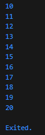

# Praktikum 1: Menerapkan Control Flows ("if/else")

## Langkah 1:

Ketik atau salin kode program berikut ke dalam fungsi main().

```dart
  String test = "test2";
  if (test == "test1") {
    print("Test1");
  } else if (test == "test2") {
    print("Test2");
  } else {
    print("Something else");
  }
  if (test == "test2") print("Test2 again");
```

## Langkah 2:

Silakan coba eksekusi (Run) kode pada langkah 1 tersebut. Apa yang terjadi? Jelaskan!

Jawab: Pada langkah 1 melakukan pengecekan kondisi string dan menampilkan output `Test2` dan `Test2 again`.


## Langkah 3:

Tambahkan kode program berikut, lalu coba eksekusi (Run) kode Anda.

```dart
String test = "true";
if (test) {
print("Kebenaran");
}
```

Apa yang terjadi ? Jika terjadi error, silakan perbaiki namun tetap menggunakan if/else.

Jawab: Terjadi error karena di dalam if harus nilainya true/false.
Berikut contoh kode yang benar

```dart
  String test = "true";
  if (test == "true") {
    print("Kebenaran");
  }
```


# Praktikum 2: Menerapkan Perulangan "while" dan "do-while"

Selesaikan langkah-langkah praktikum berikut ini menggunakan DartPad di browser Anda.

## Langkah 1:

Ketik atau salin kode program berikut ke dalam fungsi main().

```dart
while (counter < 33) {
  print(counter);
  counter++;
}
```

## Langkah 2:

Silakan coba eksekusi (Run) kode pada langkah 1 tersebut. Apa yang terjadi? Jelaskan! Lalu perbaiki jika terjadi error.

Jawab: Terjadi error karena counter belum diinisialisai, tambahkan kode ini
`var counter = 1;` sebelum kode pada langkah 1.


## Langkah 3:

Tambahkan kode program berikut, lalu coba eksekusi (Run) kode Anda.

```dart
do {
  print(counter);
  counter++;
} while (counter < 77);
```

Apa yang terjadi ? Jika terjadi error, silakan perbaiki namun tetap menggunakan do-while.

Jawab: Tidak terjadi error, tetapi hanya menampilkan counter sampai 76 karena `counter++` dijalankan terlebih dahulu sebelum pengecekan `while (counter < 77);`


# Praktikum 3: Menerapkan Perulangan "for" dan "break-continue"

Selesaikan langkah-langkah praktikum berikut ini menggunakan DartPad di browser Anda.

## Langkah 1:

Ketik atau salin kode program berikut ke dalam fungsi main().

```dart
for (Index = 10; index < 27; index) {
  print(Index);
}
```

## Langkah 2:

Silakan coba eksekusi (Run) kode pada langkah 1 tersebut. Apa yang terjadi? Jelaskan! Lalu perbaiki jika terjadi error.

Jawab: Kode itu error karena di bagian for variabel index tidak dideklarasikan tipenya, dan index tidak ada increment membuat loop akan dijalankan terus menerus. kode yang benar `for (var index = 10; index < 27; index++)`


## Langkah 3:

Tambahkan kode program berikut di dalam for-loop, lalu coba eksekusi (Run) kode Anda.

```dart
If (Index == 21) break;
Else If (index > 1 || index < 7) continue;
print(index);
```

Apa yang terjadi ? Jika terjadi error, silakan perbaiki namun tetap menggunakan for dan break-continue.

Jawab: Tidak terjadi error, tetapi karena kondisi `else if (index > 1 || index < 7)` sehingga nilai index tidak dicetak. Kode yang benar adalah `else if (index > 1 && index < 7)` supaya hanya angka yang lebih dari 1 dan kurang dari 7 yang dicetak



# Tugas Praktikum
1. Silakan selesaikan Praktikum 1 sampai 3, lalu dokumentasikan berupa screenshot hasil pekerjaan beserta penjelasannya!
2. Buatlah sebuah program yang dapat menampilkan bilangan prima dari angka 0 sampai 201 menggunakan Dart. Ketika bilangan prima ditemukan, maka tampilkan nama lengkap dan NIM Anda.

Jawab: 
```dart
void main() {
  String nama = "Candra Ahmad Dani";
  String nim = "2341720187";

  for (int n = 0; n <= 201; n++) {
    if (isPrima(n)) {
      print("$n -> $nama | $nim");
    } else {
      print(n);
    }
  }
}

bool isPrima(int n) {
  if (n < 2) return false;  
  for (int i = 2; i * i <= n; i++) {
    if (n % i == 0) return false;
  }
  return true;
}
```
