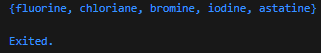

# Praktikum 1: Eksperimen Tipe Data List

Selesaikan langkah-langkah praktikum berikut ini menggunakan VS Code atau Code Editor favorit Anda.

## Langkah 1:

Ketik atau salin kode program berikut ke dalam `void main().`

```dart
var list = [1, 2, 3];
assert(list.length == 3);
assert(list[1] == 2);
print(list.length);
print(list[1]);

list[1] = 1;
assert(list[1] == 1);
print(list[1]);
```

## Langkah 2:

Silakan coba eksekusi (Run) kode pada langkah 1 tersebut. Apa yang terjadi? Jelaskan!


Jawab:Pertama membuat list [1, 2, 3], lalu menggunakan assert untuk memastikan panjang list adalah 3 dan elemen indeks ke-1 bernilai 2. Program mencetak panjang list (3) dan elemen indeks ke-1 (2), kemudian mengubah nilai indeks ke-1 dari 2 menjadi 1, memverifikasi perubahan dengan assert, dan mencetak hasil akhirnya (1), sehingga output yang muncul adalah 3, 2, dan 1.

## Langkah 3:

Ubah kode pada langkah 1 menjadi variabel final yang mempunyai index = 5 dengan default value = null. Isilah nama dan NIM Anda pada elemen index ke-1 dan ke-2. Lalu print dan capture hasilnya.

Apa yang terjadi ? Jika terjadi error, silakan perbaiki.

Jawab: Pertama membuat array dengan panjang 5 dan defaultnya null, selanjutnya array pada index ke-1 diisi nama dan pada index ke-2 NIM.

```dart
  final list = List<dynamic>.filled(5, null);
  list[1] = "Candra Ahmad Dani";
  list[2] = "2341720187";
  print(list);
```


# Praktikum 2: Eksperimen Tipe Data Set

Selesaikan langkah-langkah praktikum berikut ini menggunakan VS Code atau Code Editor favorit Anda.

## Langkah 1:

Ketik atau salin kode program berikut ke dalam fungsi main().

```dart
var halogens = {'fluorine', 'chlorine', 'bromine', 'iodine', 'astatine'};
print(halogens);
```

## Langkah 2:

Silakan coba eksekusi (Run) kode pada langkah 1 tersebut. Apa yang terjadi? Jelaskan! Lalu perbaiki jika terjadi error.



Jawab:
kode akan berjalan normal tanpa error, karena {} berisi elemen string otomatis dikenali sebagai `Set<String>`.

## Langkah 3:

Tambahkan kode program berikut, lalu coba eksekusi (Run) kode Anda.

```dart
var names1 = <String>{};
Set<String> names2 = {}; // This works, too.
var names3 = {}; // Creates a map, not a set.

print(names1);
print(names2);
print(names3);
```

Apa yang terjadi ? Jika terjadi error, silakan perbaiki namun tetap menggunakan ketiga variabel tersebut. Tambahkan elemen nama dan NIM Anda pada kedua variabel Set tersebut dengan dua fungsi berbeda yaitu .add() dan .addAll(). Untuk variabel Map dihapus, nanti kita coba di praktikum selanjutnya.

Jawab:
names1 dan names2 membuat Set kosong bertipe String, sedangkan names3 tanpa tipe dianggap Map kosong.


Output setelah ditambahkan fungsi `add()` dan `.addAll()`


# Praktikum 3: Eksperimen Tipe Data Maps

Selesaikan langkah-langkah praktikum berikut ini menggunakan VS Code atau Code Editor favorit Anda.

## Langkah 1:

Ketik atau salin kode program berikut ke dalam fungsi main().

var gifts = {
// Key: Value
'first': 'partridge',
'second': 'turtledoves',
'fifth': 1
};

var nobleGases = {
2: 'helium',
10: 'neon',
18: 2,
};

print(gifts);
print(nobleGases);

## Langkah 2:

Silakan coba eksekusi (Run) kode pada langkah 1 tersebut. Apa yang terjadi? Jelaskan! Lalu perbaiki jika terjadi error.

Jswab: Kode berjalan normal, karena `{key: value}` di Dart adalah Map. `gifts` pakai key String, `nobleGases` pakai key int, dan hasilnya ditampilkan tanpa error.


## Langkah 3:

Tambahkan kode program berikut, lalu coba eksekusi (Run) kode Anda.

```dart var mhs1 = Map<String, String>();
gifts['first'] = 'partridge';
gifts['second'] = 'turtledoves';
gifts['fifth'] = 'golden rings';

var mhs2 = Map<int, String>();
nobleGases[2] = 'helium';
nobleGases[10] = 'neon';
nobleGases[18] = 'argon';
```

Apa yang terjadi ? Jika terjadi error, silakan perbaiki.

Tambahkan elemen nama dan NIM Anda pada tiap variabel di atas (gifts, nobleGases, mhs1, dan mhs2). Dokumentasikan hasilnya dan buat laporannya!

Jawab: Pada kode tersebut, `gifts` dan `mhs1` menggunakan key String, sedangkan `nobleGases` dan `mhs2` menggunakan key int. Elemen nama dan NIM ditambahkan sesuai tipe key masing-masing, lalu saat dicetak semua map akan menampilkan pasangan key–value beserta data nama dan NIM.


# Praktikum 4: Eksperimen Tipe Data List: Spread dan Control-flow Operators

Selesaikan langkah-langkah praktikum berikut ini menggunakan VS Code atau Code Editor favorit Anda.

## Langkah 1:

Ketik atau salin kode program berikut ke dalam fungsi main().

```dart var list = [1, 2, 3];
var list2 = [0, ...list];
print(list1);
print(list2);
print(list2.length);
```

## Langkah 2:

Silakan coba eksekusi (Run) kode pada langkah 1 tersebut. Apa yang terjadi? Jelaskan! Lalu perbaiki jika terjadi error.

Jawab:Terjadi error karena `list` belum diinisalisasi. Berikut kode yang benar

```dart
  var list = [1, 2, 3];
  var list2 = [0, ...list];

  print(list);
  print(list2);
  print(list2.length);
```


`list` berisi `[1, 2, 3]`, lalu `list2` menyalin elemen dari `list` dengan spread operator dan menambahkan 0 di awal sehingga hasilnya `[0, 1, 2, 3]`, dengan panjang 4.

## Langkah 3:

Tambahkan kode program berikut, lalu coba eksekusi (Run) kode Anda.

```dart
list1 = [1, 2, null];
print(list1);
var list3 = [0, ...?list1];
print(list3.length);
```

Apa yang terjadi ? Jika terjadi error, silakan perbaiki.

Tambahkan variabel list berisi NIM Anda menggunakan Spread Operators. Dokumentasikan hasilnya dan buat laporannya!

Jawab: list1 berisi [1, 2, null], lalu list3 menyalin isinya sehingga panjangnya 4.


## Langkah 4:

Tambahkan kode program berikut, lalu coba eksekusi (Run) kode Anda.

```dart
var nav = ['Home', 'Furniture', 'Plants', if (promoActive) 'Outlet'];
print(nav);
```

Apa yang terjadi ? Jika terjadi error, silakan perbaiki. Tunjukkan hasilnya jika variabel promoActive ketika true dan false.

Jawab: Jika promoActive = true, Outlet akan tampil, jika promoActive = false maka Outlet tidak tampil.


## Langkah 5:

Tambahkan kode program berikut, lalu coba eksekusi (Run) kode Anda.

```dart
var nav2 = ['Home', 'Furniture', 'Plants', if (login case 'Manager') 'Inventory'];
print(nav2);
```

Apa yang terjadi ? Jika terjadi error, silakan perbaiki. Tunjukkan hasilnya jika variabel login mempunyai kondisi lain.

Jawab: Jika login = 'Manager' maka Inventory akan muncul, tetapi jika login selain 'Manager' Inventory tidak muncul.


## Langkah 6:

Tambahkan kode program berikut, lalu coba eksekusi (Run) kode Anda.

```dart
var listOfInts = [1, 2, 3];
var listOfStrings = ['#0', for (var i in listOfInts) '#$i'];
assert(listOfStrings[1] == '#1');
print(listOfStrings);
```

Apa yang terjadi ? Jika terjadi error, silakan perbaiki. Jelaskan manfaat Collection For dan dokumentasikan hasilnya.

Jawab: Kode menggunakan Collection For untuk membuat list baru secara dinamis dari list lain. Variabel `listOfInts = [1, 2, 3]` lalu dibuat `listOfStrings = ['#0', for (var i in listOfInts) '#$i']`, hasilnya `['#0', '#1', '#2', '#3']`. Collection For bermanfaat karena memudahkan membentuk list berdasarkan perulangan tanpa harus menulis loop terpisah.


# Praktikum 5: Eksperimen Tipe Data Records

Selesaikan langkah-langkah praktikum berikut ini menggunakan VS Code atau Code Editor favorit Anda.

## Langkah 1:

Ketik atau salin kode program berikut ke dalam fungsi main().

```dart
var record = ('first', a: 2, b: true, 'last');
print(record)
```

## Langkah 2:

Silakan coba eksekusi (Run) kode pada langkah 1 tersebut. Apa yang terjadi? Jelaskan! Lalu perbaiki jika terjadi error.

Jawab: Outputnya menampilkan urutannya adalah field posisi dulu (first, last), lalu diikuti field bernama (a: 2, b: true).


## Langkah 3:

Tambahkan kode program berikut di luar scope void main(), lalu coba eksekusi (Run) kode Anda.

```dart
(int, int) tukar((int, int) record) {
var (a, b) = record;
return (b, a);
}
```

Apa yang terjadi ? Jika terjadi error, silakan perbaiki. Gunakan fungsi tukar() di dalam main() sehingga tampak jelas proses pertukaran value field di dalam Records.

Jawab: Jika dipanggil di main(), misalnya print(tukar((1, 2)));, maka outputnya (2, 1). Ini menunjukkan proses pertukaran field dalam record.


## Langkah 4:

Tambahkan kode program berikut di dalam scope void main(), lalu coba eksekusi (Run) kode Anda.

```dart
// Record type annotation in a variable declaration:
(String, int) mahasiswa;
print(mahasiswa);
```

Apa yang terjadi ? Jika terjadi error, silakan perbaiki. Inisialisasi field nama dan NIM Anda pada variabel record mahasiswa di atas. Dokumentasikan hasilnya dan buat laporannya!

Jawab: Kode (String, int) mahasiswa; print(mahasiswa); error karena record harus diinisialisasi.

```dart
 (String, int) mahasiswa = ('Candra Ahmad Dani', 2341720187);
  print(mahasiswa);
```


## Langkah 5:

Tambahkan kode program berikut di dalam scope void main(), lalu coba eksekusi (Run) kode Anda.

```dart
var mahasiswa2 = ('first', a: 2, b: true, 'last');

print(mahasiswa2.$1); // Prints 'first'
print(mahasiswa2.a); // Prints 2
print(mahasiswa2.b); // Prints true
print(mahasiswa2.$2); // Prints 'last'
```

Apa yang terjadi ? Jika terjadi error, silakan perbaiki.

Jawab: Record `mahasiswa2` diakses dengan `$1` dan `$2` untuk data posisi (`'first'`, `'last'`), serta `.a` dan `.b` untuk data bernama (`2`, `true`).


Gantilah salah satu isi record dengan nama dan NIM Anda, lalu dokumentasikan hasilnya dan buat laporannya!


# Tugas Praktikum

1. Silakan selesaikan Praktikum 1 sampai 5, lalu dokumentasikan berupa screenshot hasil pekerjaan Anda beserta penjelasannya!
2. Jelaskan yang dimaksud Functions dalam bahasa Dart!

Jawab: Function adalah blok kode yang bisa dipanggil untuk menjalankan tugas tertentu. Fungsinya membantu membuat program lebih terstruktur dan dapat digunakan kembali. Contoh:

```dart
int tambah(int a, int b) {
  return a + b;
}
```

3. Jelaskan jenis-jenis parameter di Functions beserta contoh sintaksnya!

Jawab:

* Positional parameter: parameter urut.

`void sapa(String nama) => print("Halo $nama");`

* Optional positional: parameter opsional pakai [].

`void sapa(String nama, [String? gelar]) => print("Halo $nama $gelar");`

* Named parameter: parameter diberi nama pakai {}

`void sapa({required String nama}) => print("Halo $nama");`

* Default parameter: punya nilai bawaan.

`void sapa([String nama = "Anonim"]) => print("Halo $nama");`

4. Jelaskan maksud Functions sebagai first-class objects beserta contoh sintaknya!

Jawab: Artinya fungsi bisa diperlakukan seperti data: disimpan di variabel, dikirim sebagai argumen, atau dikembalikan dari fungsi lain.

```
var myFunc = (int x) => x * 2;
print(myFunc(5)); // 10
```

5. Apa itu Anonymous Functions? Jelaskan dan berikan contohnya!

Jawab: Anonymous function adalah fungsi tanpa nama, biasanya dipakai sekali atau dikirim ke fungsi lain.

```
var list = [1,2,3];
list.forEach((n) { print(n * 2); });
```

6. Jelaskan perbedaan Lexical scope dan Lexical closures! Berikan contohnya!

Jawab: Lexical scope: variabel hanya bisa diakses sesuai ruang lingkupnya.

```dart
void main() {
  var x = 10;
  void printX() => print(x); // bisa akses x
  printX();
}
```

Lexical closure: fungsi dapat “mengingat” variabel dari scope luar walaupun scope luar sudah selesai.

```dart
Function tambah(int a) {
  return (int b) => a + b;
}
var f = tambah(5);
print(f(3)); // 8
```

7. Jelaskan dengan contoh cara membuat return multiple value di Functions!

Jawab: Di Dart bisa pakai Record atau Map untuk mengembalikan lebih dari satu nilai.

```dart
(String, int) getMahasiswa() {
  return ("Candra", 2341720187);
}
void main() {
  var (nama, nim) = getMahasiswa();
  print("Nama: $nama, NIM: $nim");
}
```

Kumpulkan berupa link commit repo GitHub kepada dosen pengampu sesuai kesepakatan di kelas!
