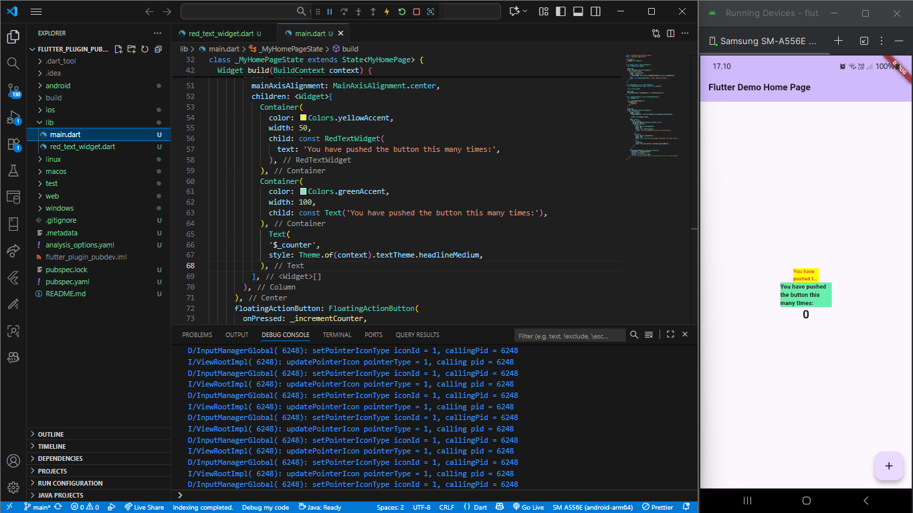

# flutter_plugin_pubdev

Nama: Candra Ahmad Dani 

NIM: 234170187

Langkah 2:
Menambahkan plugin auto_size_text agar teks dapat menyesuaikan ukuran font secara otomatis sesuai ruang tampilan. Plugin ini diambil dari pub.dev melalui perintah flutter pub add auto_size_text.

Langkah 5:
Menambahkan variabel text dan parameter di constructor agar widget RedTextWidget dapat menerima input teks dari luar. Tanpa ini, akan muncul error karena variabel text belum didefinisikan.

Langkah 6:
Terdapat dua widget:

RedTextWidget (dengan AutoSizeText) menyesuaikan ukuran teks secara otomatis agar muat dalam lebar container.

Text biasa tidak menyesuaikan ukuran teks sehingga bisa terpotong.

