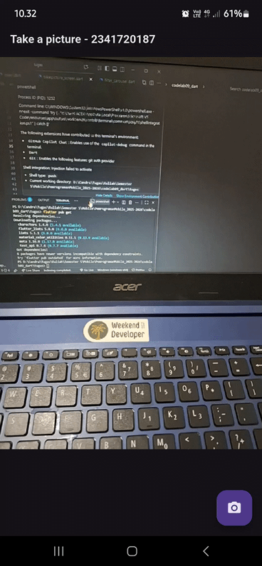

# Tugas Praktikum

Jelaskan maksud void async pada praktikum 1?

`void` async: Menandakan fungsi berjalan secara asinkron agar bisa menunggu proses (seperti kamera atau jaringan) tanpa menghentikan program utama.

Jelaskan fungsi dari anotasi @immutable dan @override ?

`@immutable`: Mdigunakan untuk menandai bahwa sebuah kelas bersifat tidak dapat diubah (immutable) setelah dibuat.

`@override`: menunjukkan bahwa sebuah metode sedang menimpa (mengganti) metode yang sudah ada di kelas induk (parent class).