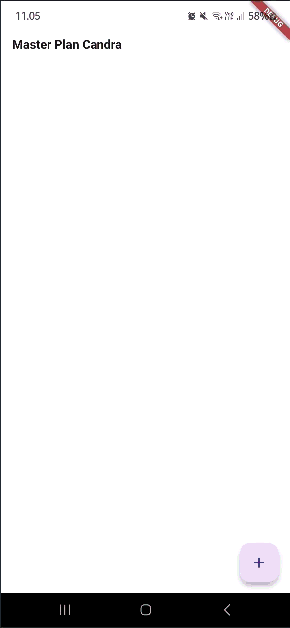
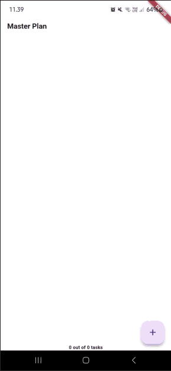

# Tugas Praktikum 1: Dasar State dengan Model-View

1. Selesaikan langkah-langkah praktikum tersebut, lalu dokumentasikan berupa GIF hasil akhir praktikum beserta penjelasannya di file `README.md`! Jika Anda menemukan ada yang error atau tidak berjalan dengan baik, silakan diperbaiki.
2. Jelaskan maksud dari langkah 4 pada praktikum tersebut! Mengapa dilakukan demikian?

   Tujuannya adalah menyederhanakan proses impor model dalam file lain.

3. Mengapa perlu variabel plan di langkah 6 pada praktikum tersebut? Mengapa dibuat konstanta ?

   dibuat agar class PlanScreen memiliki penyimpanan data rencana (daftar tugas) yang dapat diubah setiap kali pengguna menambah, mengedit, atau mencentang tugas.

4. Lakukan capture hasil dari Langkah 9 berupa GIF, kemudian jelaskan apa yang telah Anda buat!

   

   Pada Praktikum 1 membuat daftar tugas dinamis dimana:

   - Tekan tombol + untuk menambah baris tugas baru

   - Ketik teks pada kolom untuk menyimpan deskripsi

   - Centang checkbox untuk menandai tugas sudah selesai

5. Apa kegunaan method pada Langkah 11 dan 13 dalam lifecyle state ?

   - initState() dipanggil saat widget pertama kali dibuat untuk menyiapkan ScrollController dan listener agar keyboard tertutup saat layar di-scroll.

   - dispose() dipanggil saat widget dihapus untuk membersihkan ScrollController supaya tidak terjadi kebocoran memori.

6. Kumpulkan laporan praktikum Anda berupa link commit atau repository GitHub ke dosen yang telah disepakati !

# Tugas Praktikum 2: InheritedWidget

1.  Selesaikan langkah-langkah praktikum tersebut, lalu dokumentasikan berupa GIF hasil akhir praktikum beserta penjelasannya di file `README.md`! Jika Anda menemukan ada yang error atau tidak berjalan dengan baik, silakan diperbaiki sesuai dengan tujuan aplikasi tersebut dibuat.

2.  Jelaskan mana yang dimaksud `InheritedWidget` pada langkah 1 tersebut! Mengapa yang digunakan `InheritedNotifier`?

    `InheritedWidget` digunakan untuk membagikan data ke widget turunan tanpa perlu meneruskan secara manual. Sedangkan `InheritedNotifier` dipakai karena dapat otomatis memberi tahu perubahan ketika data dalam `ValueNotifier<Plan>` berubah, sehingga widget turunannya ikut diperbarui secara efisien.

3.  Jelaskan maksud dari method di langkah 3 pada praktikum tersebut! Mengapa dilakukan demikian?

    Method tersebut menghitung jumlah tugas yang selesai (completedCount) dan menampilkan pesan progres (completenessMessage). Ini dilakukan agar kemajuan plan bisa ditampilkan secara otomatis tanpa menghitung manual.

4.  Lakukan capture hasil dari Langkah 9 berupa GIF, kemudian jelaskan apa yang telah Anda buat!

    

    Praktikum 2 ini menampilkan progres dinamis dari daftar tugas dengan memanfaatkan data dari PlanProvider dan getter completenessMessage. Dimana Bagian bawah layar otomatis memperbarui teks menjadi seperti:

    “1 out of 3 tasks”, sesuai jumlah tugas yang sudah selesai.

5.  Kumpulkan laporan praktikum Anda berupa link commit atau repository GitHub ke dosen yang telah disepakati !

# Tugas Praktikum 3: State di Multiple Screens

1. Selesaikan langkah-langkah praktikum tersebut, lalu dokumentasikan berupa GIF hasil akhir praktikum beserta penjelasannya di file README.md! Jika Anda menemukan ada yang error atau tidak berjalan dengan baik, silakan diperbaiki sesuai dengan tujuan aplikasi tersebut dibuat.

2. Berdasarkan Praktikum 3 yang telah Anda lakukan, jelaskan maksud dari gambar diagram berikut ini!

   

   Bagian kiri menunjukkan struktur widget layar awal (PlanCreatorScreen), yaitu:

   - MaterialApp sebagai root aplikasi,
   - PlanProvider untuk menyimpan dan membagikan data Plan,
   - PlanCreatorScreen yang menampilkan TextField untuk menambah plan dan ListView di dalam Expanded untuk menampilkan daftar plan yang sudah ada.

   Ketika salah satu plan di daftar dipilih, aplikasi melakukan navigasi ke layar baru (PlanScreen) menggunakan Navigator.push(). Bagian kanan memperlihatkan struktur widget layar tujuan (PlanScreen), yaitu:

   - Scaffold sebagai struktur dasar layar,
   - Column yang berisi dua elemen utama:
     - Expanded dengan ListView untuk menampilkan daftar tugas (task) dalam plan,
     - SafeArea dengan Text untuk menampilkan informasi tambahan di area aman layar.

3. Lakukan capture hasil dari Langkah 14 berupa GIF, kemudian jelaskan apa yang telah Anda buat!

   

   Praktikum 3 ini ditambahkan navigasi ke halaman detail (PlanScreen) menggunakan Navigator.push(), serta fitur untuk menambah dan memperbarui tugas dengan ValueNotifier dan ValueListenableBuilder melalui PlanProvider agar data antar layar tetap sinkron secara real-time.

4. Kumpulkan laporan praktikum Anda berupa link commit atau repository GitHub ke dosen yang telah disepakati !
