# books

## Soal 1

Tambahkan nama panggilan Anda pada title app sebagai identitas hasil pekerjaan Anda.

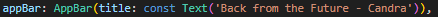

## Soal 2

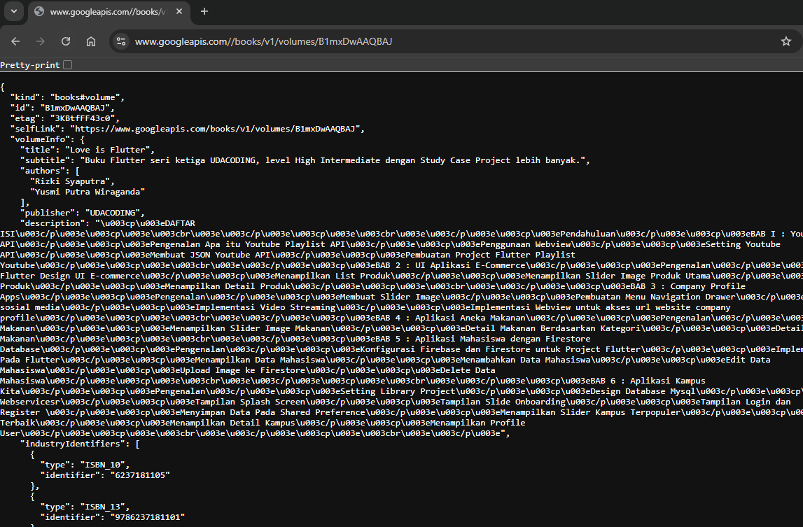

## Soal 3

Jelaskan maksud kode langkah 5 tersebut terkait `substring` dan `catchError`!

substring(0, 450) membatasi tampilan hasil hanya 450 karakter pertama, sedangkan catchError menangani kesalahan saat pengambilan data dan menampilkan pesan “An error occurred”.

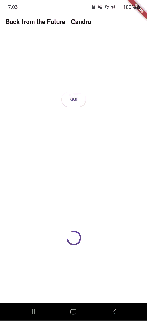

## Soal 4

Jelaskan maksud kode langkah 1 dan 2 tersebut!

Fungsi returnOneAsync(), returnTwoAsync(), dan returnThreeAsync() mensimulasikan proses asinkron (seperti menunggu data dari server) dengan jeda 3 detik, lalu mengembalikan angka 1, 2, dan 3.
Fungsi count() memanggil ketiganya satu per satu menggunakan await, menjumlahkan hasilnya, lalu menampilkan totalnya ke layar melalui setState().

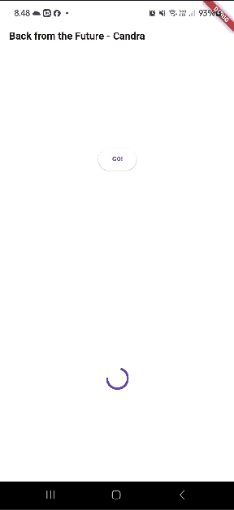

## Soal 5

Jelaskan maksud kode langkah 2 tersebut!

getNumber() membuat objek Completer, memanggil calculate(), lalu mengembalikan Future-nya.
calculate() menunggu 5 detik, lalu menyelesaikan Future tersebut dengan nilai 42.
Jadi, setelah 5 detik, pemanggil getNumber() akan menerima hasil 42.

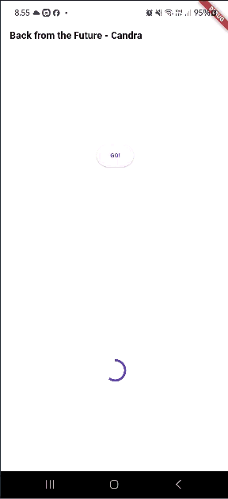

## Soal 6

Jelaskan maksud perbedaan kode langkah 2 dengan langkah 5-6 tersebut!

Perbedaannya yaitu penambahan catchError untuk menampilkan pesan “An error occurred” jika terjadi kesalahan.

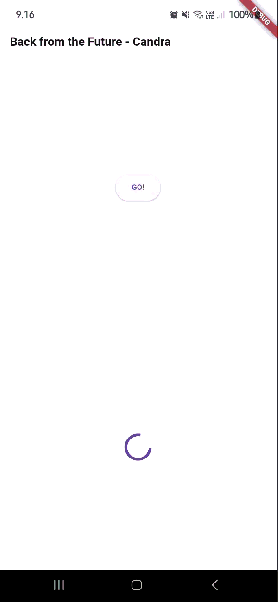

## Soal 7

## Soal 8

Jelaskan maksud perbedaan kode langkah 1 dan 4!

FutureGroup butuh proses manual (add dan close), sedangkan Future.wait langsung menjalankan semua Future sekaligus.

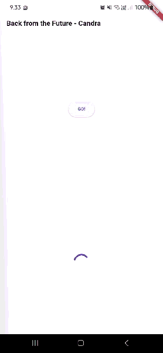

## Soal 9

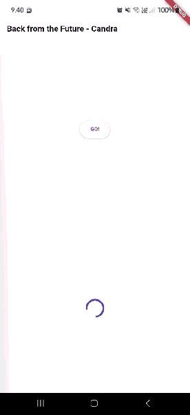

## Soal 10

Panggil method handleError() tersebut di ElevatedButton, lalu run. Apa hasilnya? Jelaskan perbedaan kode langkah 1 dan 4!

Hasilnya muncul teks "Exception: Something terrible happened!" dan di console "Complete".
Perbedaannya, langkah 1 pakai then–catchError–whenComplete, sedangkan langkah 4 pakai try–catch–finally yang lebih sederhana dan mudah dibaca.

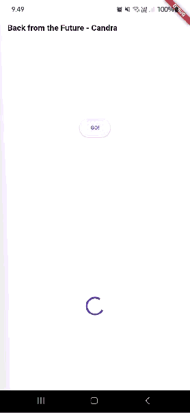

## Soal 11

Tambahkan nama panggilan Anda pada tiap properti title sebagai identitas pekerjaan Anda.

## Soal 12

Jika Anda tidak melihat animasi loading tampil, kemungkinan itu berjalan sangat cepat. Tambahkan delay pada method `getPosition()` dengan kode `await Future.delayed(const Duration(seconds: 3));`

Apakah Anda mendapatkan koordinat GPS ketika run di browser? Mengapa demikian?

Browser berhasil menampilkan koordinat GPS, menandakan fitur geolocator berfungsi dengan baik dan izin lokasi telah diberikan.

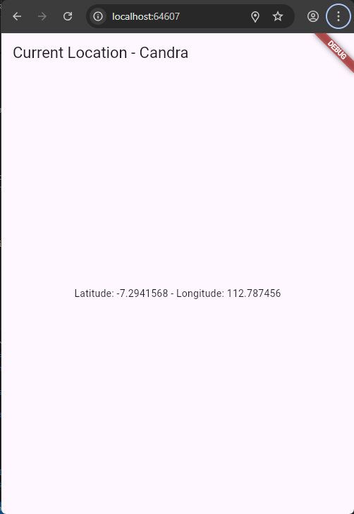

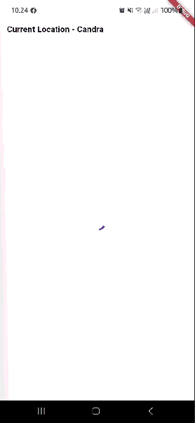
