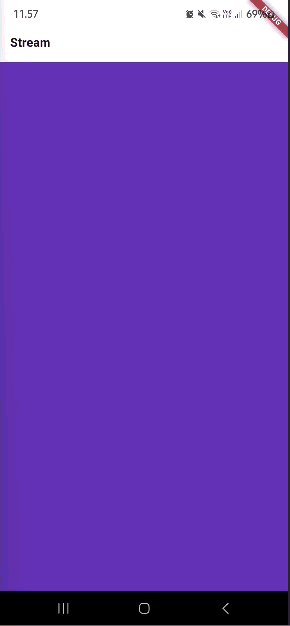
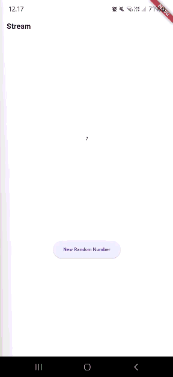
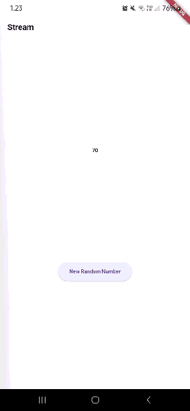

# stream_candra

## Soal 1

Tambahkan nama panggilan Anda pada title app sebagai identitas hasil pekerjaan Anda.

`title: 'Stream -  Candra',`

Gantilah warna tema aplikasi sesuai kesukaan Anda.

`theme: ThemeData(primarySwatch: Colors.orange),`

## Soal 2

Tambahkan 5 warna lainnya sesuai keinginan Anda pada variabel colors tersebut.

```
final List<Color> colors = [
  Colors.blueGrey,
  Colors.amber,
  Colors.deepPurple,
  Colors.lightBlue,
  Colors.teal,
  Colors.indigo,
  Colors.cyan,
  Colors.lime,
  Colors.pink,
  Colors.orange,
];
```

## Soal 3

Jelaskan fungsi keyword `yield*` pada kode tersebut!

`yield*` dipakai untuk meneruskan seluruh isi stream lain sebagai output stream ini tanpa perlu loop manual.

Apa maksud isi perintah kode tersebut?

Kode tersebut menghasilkan stream warna yang berubah setiap 1 detik, mengambil warna secara berulang dari daftar colors.

## Soal 4

Capture hasil praktikum Anda berupa GIF dan lampirkan di README.



## Soal 5

Jelaskan perbedaan menggunakan listen dan await for (langkah 9) !

- await for digunakan dalam fungsi async dan menunggu setiap event secara berurutan seperti loop; kode setelah loop akan berjalan setelah stream selesai.

- listen langsung mendaftarkan listener pada stream dan berjalan asinkron tanpa menunggu; stream tetap aktif dan kode setelah listen langsung dieksekusi.

## Soal 6

Jelaskan maksud kode langkah 8 dan 10 tersebut!

- `initState()` untuk menghubungkan stream ke listener. Setiap angka baru yang masuk ke stream akan langsung disimpan ke lastNumber lewat setState().
- `addRandomNumber()` untuk membuat angka acak 0–9 lalu mengirimkannya ke stream agar bisa diterima oleh listener.

Capture hasil praktikum Anda berupa GIF dan lampirkan di README.



## Soal 7

Jelaskan maksud kode langkah 13 sampai 15 tersebut!

- Langkah 13: Membuat fungsi untuk mengirim error ke stream.

- Langkah 14: Menambahkan handler supaya jika stream mengirim error, nilai lastNumber diganti menjadi -1.

- Langkah 15: Mengubah tombol agar tidak lagi mengirim angka, tetapi mengirim error ke stream.

Kembalikan kode seperti semula pada Langkah 15, comment addError() agar Anda dapat melanjutkan ke praktikum 3 berikutnya.

## Soal 8

Jelaskan maksud kode langkah 1-3 tersebut!

- Langkah 1: Membuat variabel transformer untuk mengolah data stream.

- Langkah 2: Mengisi transformer agar setiap nilai stream dikali 10, error jadi -1.

- Langkah 3: Menerapkan transformer sehingga listener menerima data yang sudah diproses.

Capture hasil praktikum Anda berupa GIF dan lampirkan di README.


