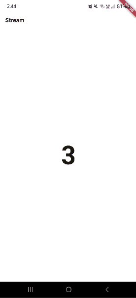

# streambuilder_candra

## Soal 12

Jelaskan maksud kode pada langkah 3 dan 7 !

- Langkah 3: Membuat stream yang setiap 1 detik menghasilkan angka acak 0–9 menggunakan `Stream.periodic`.
- Langkah 7: `StreamBuilder` mendengarkan stream tersebut dan meng-update UI otomatis setiap kali angka baru diterima, lalu menampilkannya di layar.
  Capture hasil praktikum Anda berupa GIF dan lampirkan di README.

