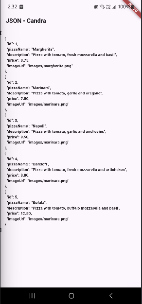
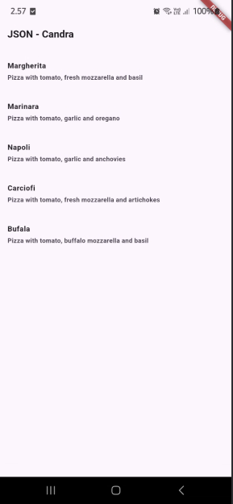
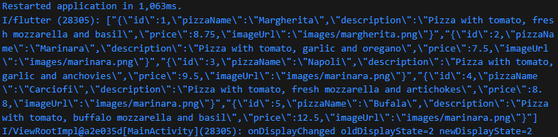
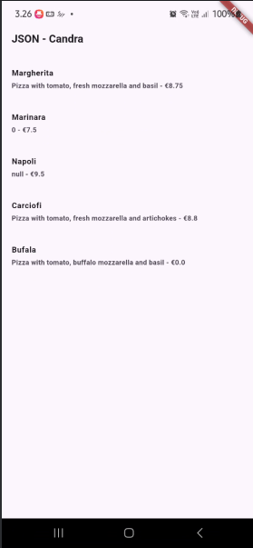
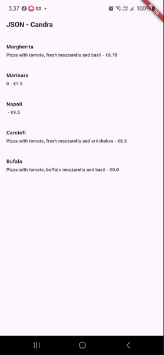
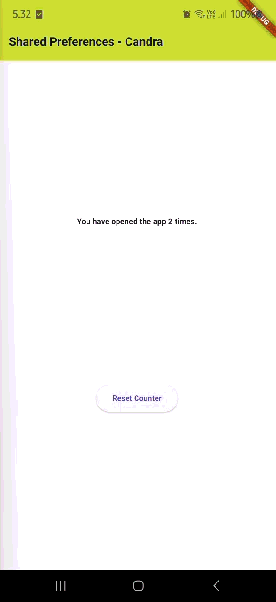
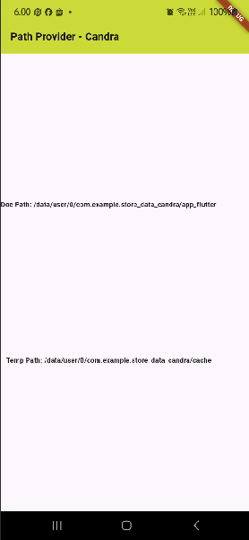
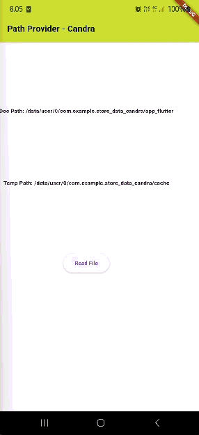

# store_data_candra

# Praktikum 1

## Soal 1

Tambahkan nama panggilan Anda pada title app sebagai identitas hasil pekerjaan Anda.

`title: 'Flutter JSON Demo - Candra',`

Gantilah warna tema aplikasi sesuai kesukaan Anda.

`theme: ThemeData(primarySwatch: Colors.lime),`

## Soal 2

Masukkan hasil capture layar ke laporan praktikum Anda.

## Soal 3

Masukkan hasil capture layar ke laporan praktikum Anda.

# Praktikum 2

## Soal 4

Capture hasil running aplikasi Anda, kemudian impor ke laporan praktikum Anda!

# Praktikum 3

## Soal 5

Jelaskan maksud kode lebih safe dan maintainable!

Kode lebih safe karena menggunakan tryParse, operator ??, dan pengecekan null sehingga mencegah aplikasi crash ketika data JSON tidak lengkap atau salah format.

Kode lebih maintainable karena menggunakan konstanta keyId, keyName, dll, sehingga jika struktur JSON berubah, cukup ubah satu tempat saja, bukan di banyak baris kode.

Capture hasil praktikum Anda dan lampirkan di README.

# Praktikum 4

## Soal 6

Capture hasil praktikum Anda berupa GIF dan lampirkan di README.

# Praktikum 5

## Soal 7

Capture hasil praktikum Anda dan lampirkan di README.

## Soal 8

Jelaskan maksud kode pada langkah 3 dan 7 !

Langkah 3: Menyimpan teks “Candra, 2341720187” ke file pizza.txt

Langkah 4: File pizza.txt dibuat otomatis saat aplikasi mulai berjalan.

Langkah 5: Membaca teks yang sudah disimpan oleh writeFile() dan menyimpan isi tersebut ke fileText agar bisa tampil di layar.

Langkah 6: Ketika tombol ini ditekan, fungsi readFile() dipanggil.

Langkah 7:File pizza.txt dibuat dan diisi dengan nama + NIM. Ketika tombol "Read File" ditekan:

- Isi file dibaca.
- Isi tersebut ditampilkan pada layar.

Capture hasil praktikum Anda berupa GIF dan lampirkan di README.

