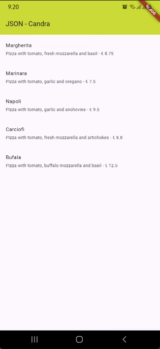
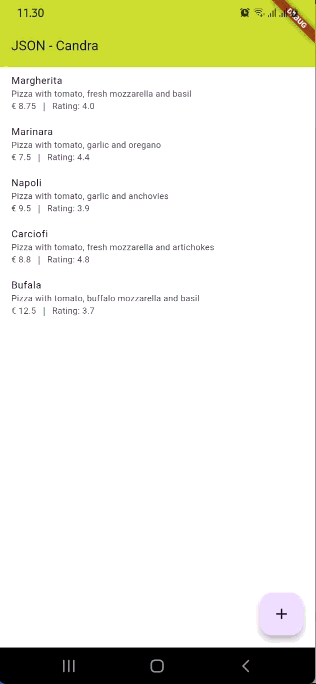
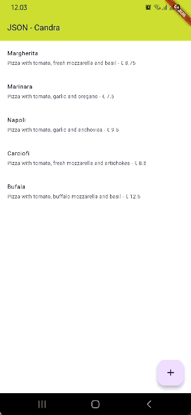

# restful_candra

# Praktikum 1

## Soal 1

Tambahkan nama panggilan Anda pada title app sebagai identitas hasil pekerjaan Anda.

`title: const Text('JSON - Candra')`

Gantilah warna tema aplikasi sesuai kesukaan Anda.

`backgroundColor: Colors.lime`

Capture hasil aplikasi Anda, lalu masukkan ke laporan di README.



# Praktikum 2

## Soal 2

Tambahkan field baru dalam JSON maupun POST ke Wiremock!

Field rating ditambahkan di JSON

```
{
    "id": 1,
    "pizzaName": "Margherita",
    "description": "Pizza with tomato, fresh mozzarella and basil","price": 8.75,
    "imageUrl": "images/margherita.png"
    "rating": 4.0
}
```

Field POST diperbarui

```
{
  "message": "Pizza created",
  "status": "success"
}
```

Capture hasil aplikasi Anda berupa GIF di README



# Praktikum 3

## Soal 3

Ubah salah satu data dengan Nama dan NIM Anda, lalu perhatikan hasilnya di Wiremock.

Capture hasil aplikasi Anda berupa GIF di README




